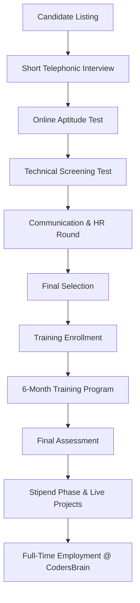
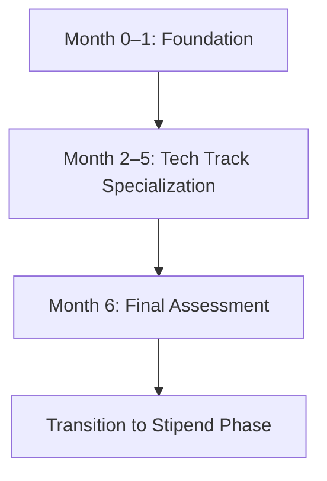

# CodersBrain Training-to-Hire Program

## **Flow Overview**

# **1. Assessment Flow (Pre-Hiring)**

## **Step 1: Short Telephonic Interview**
- Basic introduction  
- Communication clarity  
- Interest & commitment check  
- Verify eligibility criteria  

## **Step 2: Online Aptitude Test**
- Logical reasoning  
- Quantitative ability  
- Basic programming logic  
- English comprehension  

## **Step 3: Technical Screening Test**
- MCQs on programming fundamentals  
- Debugging questions  
- Small coding problems  

## **Step 4: Communication & HR Round**
- Communication clarity  
- Attitude & stability  
- Interest in 2-year bond  

## **Step 5: Final Selection & Offer**
- Top scoring candidates shortlisted  
- Offer email + training schedule shared  

---

# **2. Training Flow (6 Months)**

## **Month 0–1: Common Foundation**

### **Motivational & Engagement Program**
- Monthly motivational sessions  
- Talks by industry experts from top Bangalore colleges  
- Interactive Q&A sessions  
- Career growth & tech trends seminars  

**Note:** Candidates will also be exposed to **basic guided mini-projects** during the foundation phase.

### **Topics**
- Programming basics  
- Git & Version Control  
- SDLC + Agile + Jira  
- Database basics (SQL + NoSQL)  
- Soft skills & professional communication  

---

## **Month 2–5: Technology Track Specialization**

**Includes:**  
- Weekly sprints  
- Practical assignments  
- Live mini-projects  
- Performance reviews  

**Tracks:**
- Node.js  
- React.js  
- Angular  
- Java Full-Stack  
- Python Backend  
- GoLang  
- Automation Testing  
- DevOps  
- .NET / C#  

---

## **Month 6: Enterprise Assessment**
- Coding test  
- Project evaluation  
- Presentation + viva  
- Behavioral assessment  

---

# **3. Curriculum (Per Track)**

## **Foundation Curriculum (Common for All)**

- Programming logic  
- Data structures basics  
- Git workflow  
- SQL fundamentals  
- REST API basics  
- Agile methodologies  
- Communication skills  

### **Modern Topics**
- API Security Basics  
- Cloud Fundamentals (AWS/Azure)  
- Docker Basics  
- CI/CD Introduction  

---

## **Track-Specific Curriculum**

### **Node.js Developer Track**
- JavaScript ES6+  
- Node.js & Express.js  
- REST APIs  
- MongoDB/PostgreSQL  
- JWT Authentication  
- Redis Caching  
- Microservices intro  
- Deployment basics  

### **React.js Developer Track**
- React core + hooks  
- Routing  
- Redux Toolkit / Context  
- API integration  
- Tailwind/MUI  
- Performance optimization  
- Deployment  

### **Angular Developer Track**
- TypeScript  
- Angular architecture  
- RxJS  
- Reactive forms  
- Angular Material  
- API integration  
- CI/CD basics  

### **Java Full-Stack Track**
- Java OOP  
- Spring Boot  
- JPA/Hibernate  
- MySQL/PostgreSQL  
- REST APIs  
- Microservices basics  
- JUnit/Mockito  
- Frontend basics  

### **Python Backend Track**
- Django / FastAPI  
- ORM  
- Celery  
- SQL/NoSQL  
- PyTest  
- Deployment  

### **GoLang Track**
- Go basics  
- Concurrency  
- Gin/Fiber  
- PostgreSQL  
- Docker  
- Microservices intro  
- CI/CD basics  

### **Automation Testing Track**
- Manual testing  
- Selenium  
- TestNG/JUnit  
- API testing  
- Automation frameworks  
- Allure reporting  

### **DevOps Track**
- Linux  
- Git  
- CI/CD pipelines  
- Docker  
- Kubernetes  
- Terraform basics  
- AWS fundamentals  
- Monitoring  

### **.NET / C# Track**
- C# OOP  
- ASP.NET Core  
- EF Core  
- SQL Server  
- Identity & auth  
- Blazor basics  
- Azure deployment  

---
