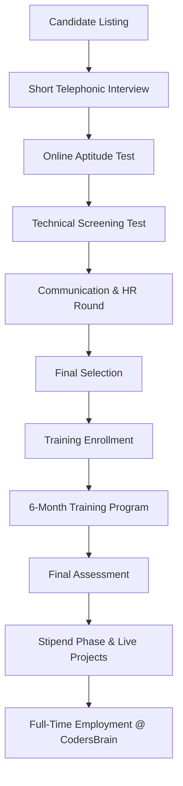
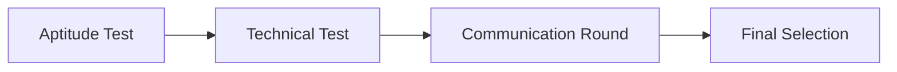
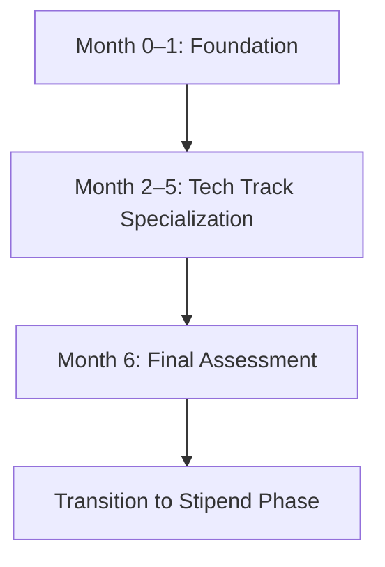

# CodersBrain Training-to-Hire Program

## **Flow Overview**

---

# **1. Assessment Flow (Pre-Hiring)**

## **Step 1: Short Telephonic Interview**

* Basic introduction
* Communication clarity
* Interest & commitment check
* Verify eligibility criteria

## **Step 2: Online Aptitude Test**

* Logical reasoning
* Quantitative ability
* Basic programming logic
* English comprehension

## **Step 3: Technical Screening Test**

* MCQs on programming fundamentals
* Debugging questions
* Small coding problems

## **Step 4: Communication & HR Round**

* Communication clarity
* Attitude & stability
* Interest in 2-year bond

## **Step 5: Final Selection & Offer**

* Top scoring candidates shortlisted
* Offer email + training schedule shared

---

# **2. Training Flow (6 Months)**

## **Month 0–1: Common Foundation**

### **Motivational & Engagement Program**

* Monthly motivational sessions
* Talks by industry experts from top Bangalore colleges
* Interactive Q&A sessions to keep students inspired
* Career growth & tech trends seminars

**

**Note:** Candidates will also be exposed to **basic guided mini‑projects** during the foundation phase to build confidence and practical understanding.

* Programming basics
* Git & Version Control
* SDLC + Agile + Jira
* Database basics (SQL + NoSQL)
* Soft skills & professional communication

## **Month 2–5: Technology Track Specialization**

**Note:** Each technology track includes **hands‑on practice with structured mini‑projects**, building gradually toward a final major project.

### Tracks:

* Node.js
* React.js
* Angular
* Java Full-Stack
* Python Backend
* GoLang
* Automation Testing
* DevOps
* .NET / C#

Each track includes:

* Weekly sprints
* Practical assignments
* Live mini-projects
* Performance reviews

## **Month 6: Enterprise Assessment**

* Coding test
* Project evaluation
* Presentation + viva
* Behavioral assessment

---

# **3. Curriculum (Per Track)**

## **Foundation Curriculum (Common for All)**

* Programming logic
* Data structures basics
* Git workflow (branching, PR, conflict handling)
* SQL fundamentals
* REST API basics
* Agile methodologies
* Communication skills
* **Modern Topics:**

  * API Security Basics
  * Cloud Fundamentals (AWS/Azure intro)
  * Docker Basics
  * CI/CD Introduction
* Programming logic
* Data structures basics
* Git workflow (branching, PR, conflict handling)
* SQL fundamentals
* REST API basics
* Agile methodologies
* Communication skills

---

## **Track-Specific Curriculum**

### **Node.js Developer Track**

* JavaScript ES6+
* Node.js & Express.js
* REST API development
* MongoDB/PostgreSQL
* Authentication (JWT)
* Caching (Redis)
* Microservices intro
* Deployment basics

### **React.js Developer Track**

* JS ES6+ fundamentals
* React core + hooks
* Routing
* Redux Toolkit / Context
* API integration
* UI libraries (Tailwind/MUI)
* Performance optimization
* Deployment (Vite/CRA)

### **Angular Developer Track**

* TypeScript
* Angular architecture
* RxJS
* Reactive forms
* Services, guards
* Angular Material
* API integration
* CI/CD basics

### **Java Full-Stack Track**

* Java OOP
* Spring Boot
* JPA/Hibernate
* MySQL/PostgreSQL
* REST APIs
* Microservices basics
* JUnit/Mockito
* Frontend basics (React/Angular)

### **Python Backend Track**

* Python OOP
* Django / FastAPI
* ORM
* Celery (background tasks)
* SQL/NoSQL
* Testing (PyTest)
* Deployment

### **GoLang Track**

* Go basics
* Concurrency (goroutines/channels)
* REST APIs (Gin/Fiber)
* PostgreSQL
* Docker + Go
* Microservices intro
* CI/CD basics

### **Automation Testing Track**

* Manual testing
* Test case writing
* Selenium WebDriver
* TestNG/JUnit
* API testing (Postman/RestAssured)
* Automation frameworks
* Reporting (Allure)

### **DevOps Track**

* Linux & shell
* Git
* CI/CD pipelines
* Docker
* Kubernetes
* Terraform basics
* AWS fundamentals
* Monitoring (Grafana)

### **.NET / C# Track**

* C# OOP
* ASP.NET Core
* EF Core
* REST API
* SQL Server
* Identity & auth
* Blazor basics
* Azure deployment

---

**
